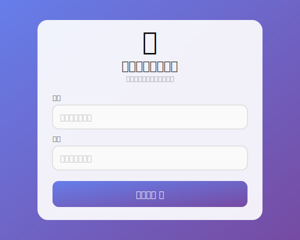
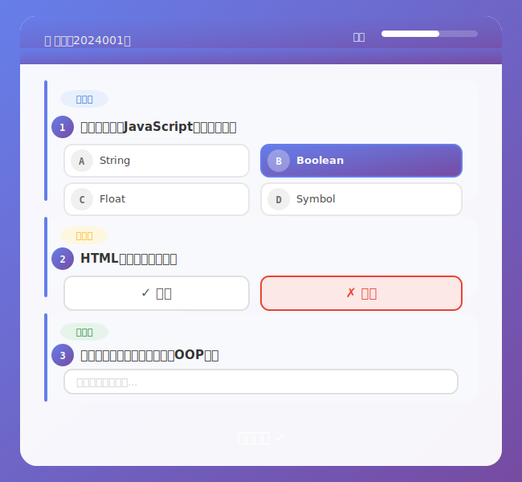
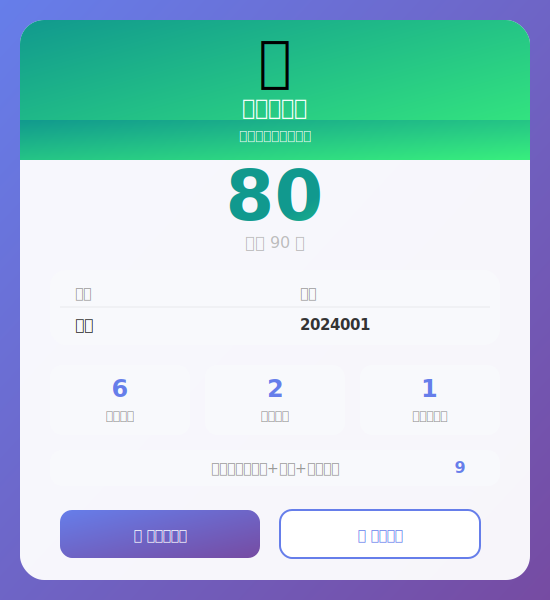
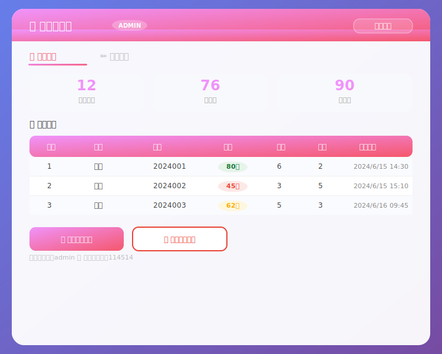
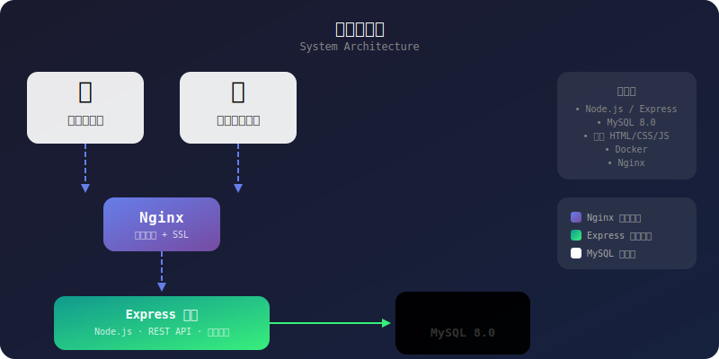

<p align="center">
  
</p>

<p align="center">
  
  
  
  
  
</p>

---

**大学社团在线答题系统**，支持选择题、判断题、简答题三种题型，自动评分、管理后台、Docker 一键部署。

## 预览

<p align="center">
  
  
</p>

<p align="center">
  
  
</p>

<p align="center">
  
</p>

## 功能

| 功能 | 说明 |
|------|------|
| 📝 **三种题型** | 选择题、判断题、简答题，覆盖全面 |
| 🤖 **自动评分** | 选择题/判断对错自动判，简答题5字满分 |
| 🛡️ **管理后台** | 题目增删改、成绩查看导出，一键管理 |
| 🐳 **Docker 部署** | 一键启动，告别环境配置烦恼 |
| 🔒 **Nginx + SSL** | 生产环境反向代理支持，安全可靠 |
| 📊 **成绩导出** | 支持 TXT 格式下载个人成绩单 |
| 🌐 **多端支持** | 浏览器即可使用，无需安装任何软件 |

## 快速启动

```bash
# 1. 安装依赖
npm install

# 2. 配置数据库（编辑 .env 文件）
# DB_HOST=127.0.0.1
# DB_USER=root
# DB_PASSWORD=你的密码
# DB_NAME=quiz_app

# 3. 启动服务（首次启动自动创建表结构和默认题目）
node server.js
```

浏览器打开 **http://localhost:3000**

> 💡 **管理员入口：** 姓名输入 `admin`，学号输入 `114514`

## Docker 部署

```bash
# 构建并启动
docker-compose up -d --build

# 查看日志
docker-compose logs -f

# 停止服务
docker-compose down
```

## 管理员接口

| 接口 | 方法 | 说明 |
|------|------|------|
| `/api/admin/questions` | `POST` | 添加题目 |
| `/api/admin/questions/:id` | `PUT` | 修改题目 |
| `/api/admin/questions/:id` | `DELETE` | 删除题目 |
| `/api/admin/records` | `GET` | 查看成绩 |
| `/api/admin/records` | `DELETE` | 清空记录 |
| `/api/admin/export` | `GET` | 导出成绩 |

## 技术栈

| 层级 | 技术 |
|------|------|
| **后端** | Express 4.18 + mysql2 |
| **数据库** | MySQL 8.0 |
| **前端** | 原生 HTML/CSS/JS |
| **部署** | Docker + Docker Compose |
| **反向代理** | Nginx（生产环境） |
| **SSL** | Let's Encrypt（生产环境） |

## 项目结构

```
quiz-web-app/
├── server.js             # 后端入口，路由 + 评分逻辑
├── database.js           # 数据库配置 + 表结构初始化
├── package.json          # 项目依赖
├── Dockerfile            # Docker 构建文件
├── docker-compose.yml    # Docker 编排配置
├── .env                  # 环境变量（数据库配置）
├── nginx.conf.example    # Nginx 配置模板
├── deploy_ssl.sh.example # SSL 部署脚本模板
├── public/
│   └── index.html        # 前端页面（全部功能内聚）
└── assets/
    ├── header.svg        # 项目横幅
    ├── architecture.svg  # 架构图
    ├── screenshot-start.svg
    ├── screenshot-quiz.svg
    ├── screenshot-result.svg
    └── screenshot-admin.svg
```

## 环境变量

| 变量 | 默认值 | 说明 |
|------|--------|------|
| `PORT` | `3000` | 服务端口 |
| `DB_HOST` | `localhost` | 数据库地址 |
| `DB_PORT` | `3306` | 数据库端口 |
| `DB_USER` | `root` | 数据库用户 |
| `DB_PASSWORD` | `` | 数据库密码 |
| `DB_NAME` | `quiz_app` | 数据库名称 |

## 默认题目

首次启动时，系统自动导入 9 道默认题目：

- 4 道**选择题**（JS 数据类型、CSS 圆角、HTML Canvas、Git 命令）
- 3 道**判断题**（HTML 语言性质、Python 缩进、HTTP 端口）
- 2 道**简答题**（OOP 三大特性、SQL 增删改查）
